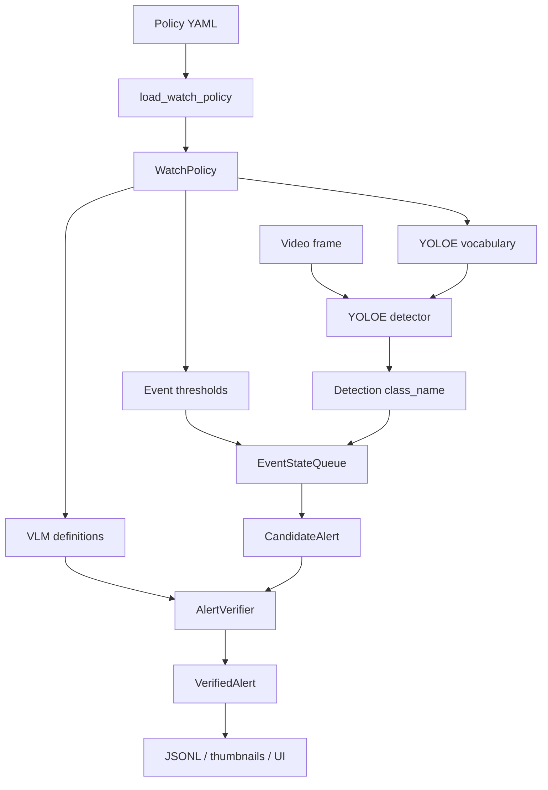

# Watch Policies

VRS watch policies describe which safety events the runtime should detect and how each event should be verified. They are intentionally written as plain YAML so the same model can be maintained by engineers today and later by operators through a UI.

The default policy lives in [`configs/policies/safety.yaml`](./safety.yaml).

## Runtime role

A watch policy is the event registry for the two-stage cascade:

```text
policy YAML
  -> load_watch_policy()
  -> WatchPolicy
      -> YOLOE open-vocabulary detector prompts
      -> per-event score and persistence thresholds
      -> VLM verifier event definitions
      -> alert severity metadata
```

The detector does not own a fixed enum of event classes. Instead, each policy entry expands into one or more detector prompts. YOLOE receives those prompts as open-vocabulary classes, and VRS maps each raw prompt hit back to the policy event name.

## Policy item schema

Each `watch` entry defines one event class.

```yaml
watch:
  - name: falldown
    detector:
      - "person lying on the ground"
      - "fallen person"
      - "collapsed person"
    verifier: "A person has collapsed and is lying motionless on the floor"
    severity: high
    min_score: 0.35
    min_persist_frames: 3
    verifier_window_s: 6.0
```

| Field | Required | Purpose |
|-------|----------|---------|
| `name` | yes | Stable event id used in alerts, metrics, UI, and routing. |
| `detector` | yes | One or more noun-phrase prompts passed to YOLOE. Multiple prompts improve recall. |
| `verifier` | yes | One-sentence event definition passed to the VLM verifier. |
| `severity` | no | Operator severity: `info`, `low`, `medium`, `high`, or `critical`. Defaults to `medium`. |
| `min_score` | no | Per-event detector confidence floor. The runtime uses at least the global detector floor. |
| `min_persist_frames` | no | Number of recent frames that must contain the event before promotion to `CandidateAlert`. Defaults to `2`. |
| `verifier_window_s` | no | Per-event clip context window for VLM verification. Falls back to the runtime verifier window. |

## End-to-end flow



The fast path runs on sampled frames and produces detections. The event-state queue promotes only stable detections that satisfy the per-event persistence rule. The slow path receives a short keyframe clip and verifies whether the detector claim is physically visible and consistent across frames.

## Adding a new event

Add another item under `watch`:

```yaml
  - name: intrusion
    detector:
      - "person entering restricted area"
      - "unauthorized person"
      - "person climbing fence"
    verifier: "A person has entered a restricted or prohibited area without authorization"
    severity: high
    min_score: 0.35
    min_persist_frames: 2
    verifier_window_s: 6.0
```

A good event definition should have:

- a short, stable `name` suitable for JSON and metrics;
- detector prompts that describe visible objects or states, not long reasoning instructions;
- a verifier sentence that defines the real-world condition to confirm;
- a persistence threshold tuned to the expected visual duration of the event.

## UI-driven policy editing

The current YAML model can be exposed through a UI because each policy item is already a structured object. The recommended production shape is:

```text
Policy UI
  -> Policy API
  -> validation and preview
  -> versioned policy store
  -> active policy export
  -> runtime reload or worker restart
```

The UI should not write arbitrary YAML directly. It should submit structured policy objects to a Policy API. The API should validate, normalize, version, and then either store the policy in a database or export a YAML snapshot compatible with the current runtime.

A future API payload can map directly to the watch item schema:

```json
{
  "name": "intrusion",
  "detector_prompts": [
    "person entering restricted area",
    "unauthorized person",
    "person climbing fence"
  ],
  "verifier_prompt": "A person has entered a restricted or prohibited area without authorization",
  "severity": "high",
  "min_score": 0.35,
  "min_persist_frames": 2,
  "verifier_window_s": 6.0
}
```

## Validation requirements

The runtime loader already validates required fields, severity values, score ranges, persistence, verifier windows, and duplicate names. A UI-facing Policy API should add stricter product-level validation:

- allow only stable ids for `name`, for example `^[a-z][a-z0-9_]*$`;
- reject empty detector prompts and empty verifier definitions;
- limit the number and length of detector prompts;
- enforce `min_score` and `min_persist_frames` bounds suitable for the deployment;
- warn on vague verifier definitions such as "dangerous situation";
- require confirmation before deleting an active event class;
- preserve policy version history and rollback metadata.

## Runtime reload strategy

Policy changes affect multiple runtime components:

- YOLOE vocabulary is built from detector prompts.
- Event-state queues are initialized per event class.
- Verifier prompts and JSON schemas are built from the active policy names.

For the first UI implementation, prefer a safe worker restart after policy activation. Hot reload is possible later, but it must define what happens to existing sliding-window state, cooldown state, and in-flight verifier requests when classes are added, removed, or renamed.

Recommended phases:

1. Policy CRUD in the UI, with activation triggering inference worker restart.
2. Policy preview and sample-clip evaluation before activation.
3. Hot reload for threshold-only changes.
4. Controlled hot reload for class additions.
5. Scenario policy packs for site, camera, zone, and customer-specific interpretation.

## Security notes

User-authored verifier definitions are inserted into the verifier prompt. Treat them as data, not instructions. The Policy API should sanitize or reject prompt-injection-like text, keep the system prompt authoritative, and render user policy text in a constrained template.

Detector prompts should remain short visual noun phrases. Long procedural instructions belong in reviewed scenario policies, not in the detector prompt list.

## Watch policy vs scenario policy

`WatchPolicy` defines the coarse event registry: what to detect, how sensitive the fast path should be, and how the verifier should define the event.

Scenario policy packs are a future/higher-level layer for interpreting the same coarse event differently by site, camera, zone, detector label, confidence, or operating context. For example, `fire` may have different decision hints and recommended actions in a kitchen, factory floor, outdoor smoking area, or parking lot.
