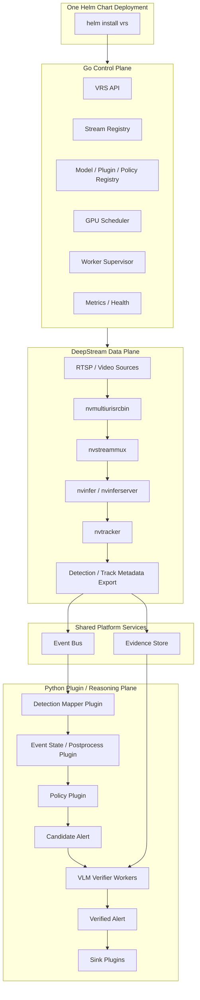

# VRS Next Architecture: DeepStream-Based Decoder Pool, GPU-Aware Scheduling, and Plugin Runtime

## 1. Executive Summary

VRS has already validated the core two-stage video reasoning pattern: a fast detector generates detections, an event-state layer filters and stabilizes those detections into candidate alerts, and a slower VLM verifier performs semantic validation before alerts are emitted.

The current implementation is a strong Python-based prototype and runtime. It supports multi-stream processing, shared detector and verifier workers, bounded queues, backpressure handling, configurable watch policies, multiple VLM backends, and local artifact-based outputs.

The next architectural step is to evolve VRS from a Python-centered prototype into a production-grade GPU video analytics platform.

This document proposes a new architecture based on the following principles:

1. Use NVIDIA DeepStream as the video data plane for RTSP ingest, decoding, stream multiplexing, primary inference, tracking, and detection/track metadata export.
2. Introduce a Go-based control plane for stream registry, GPU-aware scheduling, worker supervision, configuration distribution, and health management.
3. Preserve Python as the plugin and reasoning plane for postprocessing, policy evaluation, VLM verification, calibration, and sink integrations.
4. Package the full platform as a single Helm chart that can run on both k3s edge nodes and standard Kubernetes clusters.
5. Treat GPU allocation as a first-class scheduling concern, especially between DeepStream decoder/detector workloads and VLM verifier workers.

The target architecture keeps the existing VRS philosophy intact: fast local candidate generation, bounded processing, optional slow semantic verification, and clear event contracts. DeepStream does not replace VRS; it becomes the production-grade video data plane underneath VRS.

This document defines the lower architecture layer: ingest, scheduling, GPU placement, event transport, evidence storage, and runtime boundaries. The VSS/SAM3 blueprint remains the application-capability layer for segmentation evidence, semantic search, summarization, incident Q&A, and operator feedback.

---

## 2. Current Baseline

The current VRS runtime is organized as a two-stage cascade.

At a high level, the current multi-stream path looks like this:

```text
RTSP / MP4 sources
  -> per-stream decoder threads
  -> shared frame queue
  -> shared detector worker
  -> candidate alert queue
  -> shared VLM verifier worker
  -> per-stream sink workers
```

The current baseline has several strengths:

* Multi-stream support is already present.
* The detector is shared across streams and performs batched inference.
* The verifier is abstracted behind a backend protocol.
* Bounded queues provide backpressure and frame/candidate dropping behavior.
* Per-stream sink workers isolate output handling.
* Metrics exist for queue depth, dropped items, detector latency, verifier latency, and alert counts.
* Watch policies define event categories, thresholds, persistence windows, and verifier behavior.
* VLM backends can be swapped between local transformers, vLLM, OpenAI-compatible endpoints, and the structurally implemented but target-benchmark-gated TensorRT-LLM backend.
* The local demo and development workflow are already useful for experimentation and evaluation.

However, the current architecture is still limited as a production video analytics platform.

The main limitations are:

* Decode is still handled through Python-side readers, primarily OpenCV or optional NVDEC via OpenCV CUDA bindings.
* The DeepStream path is not implemented yet.
* GPU assignment is mostly static through runtime configuration.
* There is no cluster-level or pod-level GPU-aware scheduler.
* The current bounded queues are in-process, not distributed.
* The current deployment model is closer to local runtime or Docker Compose than Helm-native k3s/k8s operation.
* Detector, verifier, policy, and sink extensibility exist in pieces, but there is not yet a complete platform-level plugin model.

Therefore, the next architecture should promote the validated prototype into a modular runtime platform.

---

## 3. Target Architecture Overview

The proposed architecture splits VRS into four planes:

```text
1. DeepStream Data Plane
2. Go Control Plane
3. Python Plugin / Reasoning Plane
4. Helm-Native Platform Layer
```

The high-level flow is:

```text
RTSP / video / sensor sources
  -> DeepStream Data Plane
      -> decode
      -> stream mux
      -> primary detector
      -> tracker
      -> detection / track metadata export

  -> Event Bus / Evidence Store

  -> Python Plugin / Reasoning Plane
      -> detection mapping
      -> event state and postprocessing
      -> policy evaluation
      -> candidate alert
      -> optional VLM verification
      -> verified alert
      -> sink plugins

  -> Alert API / dashboard / VMS / external systems
```

The control flow is:

```text
Helm chart
  -> installs VRS platform

Go Control Plane
  -> manages streams
  -> places streams onto DeepStream pods
  -> distributes model and policy config
  -> supervises workers
  -> monitors health and queue pressure
  -> coordinates GPU groups
```

A simplified diagram:



---

## 4. Design Goals

The target architecture is designed around the following goals.

### 4.1 Production-Grade RTSP Ingestion

RTSP ingest, reconnect handling, decode, stream batching, and primary inference should no longer depend on Python threads and OpenCV as the main production path.

DeepStream should become the preferred video data plane for high-density deployments.

### 4.2 GPU-Aware Runtime Separation

DeepStream workloads and VLM verifier workloads have very different GPU behavior.

DeepStream workloads are continuous, latency-sensitive, and stream-oriented.

VLM workloads are bursty, memory-intensive, and event-driven.

They should not compete for the same GPU by default. The scheduler must understand GPU roles and place workloads accordingly.

### 4.3 Plugin-Based Project Customization

New projects should not require changes to the core runtime.

Project-specific behavior should be implemented through:

* DeepStream-side metadata adapters or parsers.
* VRS-side postprocess plugins.
* Policy plugins.
* VLM verifier plugins.
* Sink plugins.
* Helm values and policy configuration.

### 4.4 Single Installation Unit

The platform should be installable using one Helm chart.

The same chart should support:

* Single-node k3s edge deployment.
* Single-server multi-GPU deployment.
* Multi-node Kubernetes cluster deployment.
* Optional external platform services.

### 4.5 Contract-First Integration

DeepStream, Python plugins, event buses, object storage, and sinks should communicate through versioned contracts. The current repository defines the first contract set in `contracts/schemas/` with runtime adapters in `vrs.contracts`; the legacy local `alerts.jsonl` shape remains an audit/export compatibility surface.

The platform should define canonical schemas for:

* Stream source.
* Detection result (`detection.v1`).
* Candidate alert (`candidate_alert.v1`).
* Verified alert (`verified_alert.v1`).
* Evidence reference (`evidence_ref.v1`).
* Stream source (`stream.v1`).
* Object metadata manifest (`object_manifest.v1`).
* Track metadata (currently carried as `track_id` on `detection.v1`; a dedicated `track.v1` contract is deferred until DeepStream tracker metadata is wired).
* Policy decision.
* Sink delivery result.

DeepStream emits detections, tracks, and evidence references by default. VRS event-state and policy code is the boundary that promotes those inputs to `candidate_alert.v1`; VLM verifier workers then produce `verified_alert.v1`. VLM verification is not part of the DeepStream data plane.

The first runtime boundary interfaces are in place: `vrs.transport` defines the
service-free `EventTransport` shape plus Redis Streams and Kafka naming configs,
and `vrs.storage` defines `ObjectStore` with a local filesystem implementation
and S3/SeaweedFS-compatible URI config scaffold. These are scaffolds for the bus and
object-store adapters; they are not production Redis, Kafka, S3, or SeaweedFS
clients yet.

`vrs.deepstream.adapter` provides the dependency-free DeepStream metadata
boundary. `python -m vrs.deepstream.worker` is a runnable metadata adapter that
converts DeepStream-style JSON/JSONL metadata into `detection.v1`; it does not
run DeepStream, GStreamer, RTSP ingest, `nvstreammux`, `nvinfer`, or
`nvtracker`. A production DeepStream exporter should map `NvDsFrameMeta` and
`NvDsObjectMeta` fields into `DeepStreamDetectionMetadata`, then publish the
resulting `detection.v1` record.

---

## 5. DeepStream Data Plane

The DeepStream data plane is responsible for high-throughput video processing.

Its responsibilities are:

* RTSP and video source ingest.
* Dynamic source add/remove.
* Hardware-accelerated decode.
* Multi-stream batching.
* Primary detector inference.
* Tracking.
* Optional ROI or line-crossing analytics.
* Detection, track, and optional analytics metadata export.
* Evidence image or short clip extraction.

The target DeepStream pipeline is:

```text
nvmultiurisrcbin
  -> nvstreammux
  -> nvinfer / nvinferserver
  -> nvtracker
  -> nvdsanalytics optional
  -> custom metadata exporter
  -> event bus / evidence store
```

### 5.1 Why DeepStream

DeepStream is a better fit for production RTSP handling than a custom Python decoder pool because it already provides the media pipeline foundation required for high-density GPU video analytics.

The key capabilities are:

* Stream source management.
* GStreamer-based media control.
* NVDEC-first decode path.
* Multi-stream batching through stream muxing.
* TensorRT-based primary inference.
* Tracker integration.
* Message broker integration.
* GPU-efficient media processing.

VRS should not attempt to rebuild these capabilities in Python unless there is a strong portability requirement.

### 5.2 DeepStream as Runtime Adapter

DeepStream should be treated as a runtime adapter, not as the entire VRS architecture.

The VRS platform should preserve the non-DeepStream runtime path for:

* Unit tests.
* CPU-only development.
* Offline dataset evaluation.
* Smaller deployments.
* Model experimentation.

The DeepStream path should be the preferred production path for RTSP-heavy deployments.

### 5.3 DeepStream Output Contract

DeepStream output should be normalized before entering the VRS event pipeline.
The default DeepStream contract is `detection.v1`, not `candidate_alert.v1`.
Python-side event state and policy evaluation should promote detections into
`candidate_alert.v1` so the DeepStream path and non-DeepStream path share the
same alert semantics.

Example detection contract:

```json
{
  "schema_version": "detection.v1",
  "frame_id": "frame-20260629-000001",
  "source_id": "cam-001",
  "camera_id": "cam-001",
  "site_id": "edge-site-001",
  "timestamp_ms": 1782720000000,
  "model": {
    "name": "primary-yolo",
    "version": "1.0.0",
    "runtime": "deepstream-nvinfer"
  },
  "detections": [
    {
      "class_name": "person",
      "bbox_xyxy": [100, 120, 320, 480],
      "confidence": 0.87,
      "track_id": "person-17"
    }
  ],
  "evidence": {
    "frame_ref": "s3://vrs-evidence/cam-001/frame-000001.jpg",
    "clip_ref": "s3://vrs-evidence/cam-001/context-000001.mp4"
  },
  "metadata": {
    "zone_id": "entrance"
  }
}
```

If a deployment intentionally runs DeepStream-side analytics that already
implements the same VRS persistence and policy rules, it may publish
`candidate_alert.v1`; otherwise DeepStream should publish detections and track
metadata only.

The event bus should carry metadata and references, not raw video frames.

---

## 6. Go Control Plane

The Go control plane manages runtime state and scheduling.

It should not run ML inference directly. Instead, it coordinates DeepStream pods, VLM workers, plugin workers, and platform services.

Its responsibilities are:

* Stream registry.
* Source add/remove/update.
* Model registry.
* Plugin registry.
* Policy registry.
* GPU group configuration.
* Stream placement.
* DeepStream pod assignment.
* Worker lifecycle supervision.
* Health checking.
* Metrics aggregation.
* Configuration rendering and distribution.
* Backpressure-aware routing.

The major components are:

```text
vrs-api
vrs-stream-registry
vrs-model-registry
vrs-policy-registry
vrs-gpu-scheduler
vrs-worker-supervisor
vrs-config-renderer
vrs-health-manager
```

### 6.1 Stream Registry

The stream registry stores camera or video source definitions.

A stream record should include:

```yaml
id: cam-001
siteId: edge-site-001
uri: rtsp://example/stream1
enabled: true
targetFps: 4
policies:
  - falldown
  - fire
  - intrusion
placement:
  preferredGpuGroup: deepstream
  maxLatencyMs: 500
metadata:
  location: entrance
  privacyZone: public
```

### 6.2 GPU Scheduler

The VRS GPU scheduler is not a replacement for the Kubernetes scheduler.

Kubernetes places pods on nodes and assigns GPU devices.

The VRS GPU scheduler decides:

* Which DeepStream pod should own a stream.
* Which GPU group should run a model.
* Whether to scale DeepStream pods.
* Whether to scale VLM verifier workers.
* Whether to drop, delay, or downgrade low-priority tasks.
* Whether a noisy stream should be isolated.
* Whether queue pressure requires policy adjustment or operational alerting.

The scheduler should reason about GPU groups:

```yaml
gpuGroups:
  deepstream:
    role: rtsp_decode_primary_detector_tracker
    maxStreamsPerPod: 16
    targetFpsPerStream: 4
    batchSize: 16
    nodeSelector:
      vrs.ai/gpu-role: deepstream

  verifier:
    role: vlm_verification
    maxConcurrentRequests: 2
    queueSize: 64
    nodeSelector:
      vrs.ai/gpu-role: verifier

  batch:
    role: offline_analysis
    priority: low
    nodeSelector:
      vrs.ai/gpu-role: batch
```

### 6.3 Scheduling Principle

DeepStream and VLM workers should be separated by default.

Recommended default:

```text
GPU 0..N:
  DeepStream pipeline pods

GPU N+1..M:
  VLM verifier workers

Optional:
  Batch or offline analysis workers
```

The reason is simple:

* DeepStream requires stable real-time throughput.
* VLM inference can create long latency spikes and high VRAM pressure.
* Mixing them on the same GPU can degrade live alert behavior.

---

## 7. Python Plugin and Reasoning Plane

Python remains the best fit for project-specific model reasoning and AI workflow logic.

The Python plane should handle:

* Detection mapping.
* Postprocessing.
* Policy evaluation.
* VLM prompt construction.
* VLM verification.
* Structured output parsing.
* Calibration.
* Incident correlation.
* Sink integration.
* Evaluation harnesses.

The plugin flow is:

```text
DetectionEvent
  -> DetectionMapperPlugin
  -> PostprocessPlugin
  -> PolicyPlugin
  -> CandidateAlert
  -> optional VLMVerifierPlugin
  -> VerifiedAlert
  -> SinkPlugin
```

### 7.1 Plugin Types

The platform should define at least these plugin types:

```text
DetectionMapperPlugin
PostprocessPlugin
PolicyPlugin
VerifierPlugin
SinkPlugin
EvidencePlugin
```

### 7.2 Example Plugin Contract

```python
class PostprocessPlugin:
    name: str
    input_schema: str
    output_schema: str

    def process(self, candidate: dict, context: dict) -> dict:
        ...
```

```python
class PolicyPlugin:
    name: str

    def evaluate(self, event: dict, context: dict) -> dict:
        ...
```

```python
class SinkPlugin:
    name: str

    def write(self, event: dict, context: dict) -> None:
        ...
```

### 7.3 VLM Verifier Workers

VLM verifier workers should run as independent worker deployments.

They may use:

* vLLM.
* transformers.
* OpenAI-compatible served VLM endpoints.
* TensorRT-LLM.
* Future SGLang or other serving backends.

A verifier worker should consume candidate alerts and evidence references, then emit a verified alert.

The canonical verifier input/output names should stay aligned with the current
VRS contracts and the application-layer blueprint: verifier workers consume
`candidate_alert.v1` records and emit `verified_alert.v1` records.

Example verified alert:

```json
{
  "schema_version": "verified_alert.v1",
  "alert_id": "alert-20260629-000001",
  "event_id": "evt-20260629-000001",
  "source_id": "cam-001",
  "camera_id": "cam-001",
  "event_type": "falldown",
  "true_alert": true,
  "confidence": 0.91,
  "severity": "high",
  "rationale": "The person remains on the floor across multiple frames and does not stand up during the context window.",
  "verifier": {
    "backend": "vllm",
    "model": "qwen-vl",
    "latency_ms": 1840
  },
  "evidence": {
    "thumbnail_ref": "s3://vrs-evidence/cam-001/evt-000001.jpg",
    "clip_ref": "s3://vrs-evidence/cam-001/evt-000001.mp4"
  }
}
```

---

## 8. Event Bus and Evidence Store

The event bus decouples the DeepStream data plane from the plugin and reasoning plane.

Supported implementations should include:

* Redis Streams for lightweight edge deployments and GPU worker queues.
* Kafka for larger production cluster deployments that need durable replay.

The evidence store keeps thumbnails, clips, masks, track files, exported
metadata manifests, and other artifacts. For production deployments, object
storage should be the canonical storage layer for evidence and metadata
manifests. Databases can be added as query indexes or operational projections,
but should not become the only durable copy of event evidence.

Supported implementations should include:

* Local PVC for k3s edge.
* SeaweedFS for on-prem object storage.
* S3-compatible storage for cluster or enterprise deployments.

### 8.1 Message Design

Event messages should contain metadata and object references.

They should not carry large raw video payloads.

Good:

```json
{
  "event_id": "evt-001",
  "source_id": "cam-001",
  "event_type": "fire",
  "thumbnail_ref": "s3://bucket/cam-001/evt-001.jpg",
  "clip_ref": "s3://bucket/cam-001/evt-001.mp4"
}
```

Avoid:

```json
{
  "event_id": "evt-001",
  "raw_frame_base64": "..."
}
```

This keeps queues lightweight and makes retry behavior predictable.

---

## 9. Helm-Native Deployment Model

The target platform should be installed through a single Helm chart.

The chart should support both:

* k3s edge mode.
* Kubernetes cluster mode.

The chart should include:

```text
vrs-api
vrs-scheduler
vrs-deepstream-pipeline
vrs-plugin-worker
vrs-verifier-worker
vrs-sink-worker
event-bus
evidence-store
metrics
dashboard
```

### 9.1 Chart Layout

Recommended chart structure:

```text
charts/vrs/
  Chart.yaml
  values.yaml
  templates/
    vrs-api-deployment.yaml
    vrs-scheduler-deployment.yaml
    deepstream-deployment.yaml
    verifier-deployment.yaml
    plugin-worker-deployment.yaml
    event-bus-statefulset.yaml
    evidence-store-pvc.yaml
    configmaps.yaml
    secrets.yaml
    serviceaccount.yaml
    servicemonitor.yaml
    ingress.yaml
  charts/
    redis/
    seaweedfs/
    prometheus-stack/
```

External services should also be supported:

```yaml
eventBus:
  embedded: false
  type: kafka
  external:
    brokers:
      - kafka-01:9092
      - kafka-02:9092

evidenceStore:
  type: s3
  bucket: vrs-evidence
  endpoint: https://s3.example.com
```

### 9.2 k3s Edge Profile

A k3s edge deployment should prefer local simplicity.

```yaml
global:
  mode: edge
  runtime: k3s

eventBus:
  type: redis
  embedded: true

evidenceStore:
  type: pvc
  size: 500Gi
  storageClassName: local-path

deepstream:
  replicas: 1
  gpu:
    limit: 1
  pipeline:
    maxStreamsPerPod: 16
    targetFps: 4
    streammux:
      batchSize: 16

verifier:
  replicas: 1
  gpu:
    limit: 1
  backend: vllm
```

### 9.3 Kubernetes Cluster Profile

A cluster deployment should support horizontal scale-out.

```yaml
global:
  mode: cluster
  runtime: kubernetes

eventBus:
  type: kafka
  embedded: false

evidenceStore:
  type: s3

deepstream:
  replicas: 6
  autoscaling:
    enabled: true
    minReplicas: 2
    maxReplicas: 12
    metric: streams_per_pod
    target: 12
  gpu:
    limit: 1
    nodeSelector:
      vrs.ai/gpu-role: deepstream

verifier:
  replicas: 4
  autoscaling:
    enabled: true
    minReplicas: 1
    maxReplicas: 8
    metric: verifier_queue_depth
    target: 32
  gpu:
    limit: 1
    nodeSelector:
      vrs.ai/gpu-role: verifier
```

---

## 10. Scaling Model

The platform scales along four independent axes.

### 10.1 Stream Scaling

When camera count increases:

```text
more streams
  -> scheduler assigns streams to existing DeepStream pods
  -> if no capacity remains, scale DeepStream pods
  -> if no GPU capacity remains, add GPU nodes
```

### 10.2 DeepStream Pod Scaling

When decode or primary detector load increases:

```text
DeepStream queue pressure
  -> increase DeepStream replicas
  -> rebalance stream placement
  -> adjust max streams per pod
```

### 10.3 VLM Worker Scaling

When candidate alert volume increases:

```text
  candidate alert queue depth rises
  -> scale verifier workers
  -> add verifier GPU nodes
  -> adjust policy thresholds if the site is too noisy
```

### 10.4 Plugin and Sink Scaling

When downstream delivery or transformation becomes the bottleneck:

```text
sink queue pressure rises
  -> scale plugin workers
  -> scale sink workers
  -> isolate slow external integrations
```

---

## 11. GPU Allocation Strategy

The central operational problem is GPU allocation.

DeepStream and VLM inference should be treated as different workload classes.

### 11.1 Recommended GPU Roles

```text
deepstream:
  continuous RTSP decode, mux, detector, tracker

verifier:
  event-driven VLM verification

batch:
  offline summarization, reprocessing, evaluation, optional segmentation
```

### 11.2 Single Server Example

For a 4-GPU server:

```text
GPU 0:
  DeepStream pipeline pod #1

GPU 1:
  DeepStream pipeline pod #2

GPU 2:
  VLM verifier workers

GPU 3:
  Batch analysis or standby verifier capacity
```

### 11.3 Multi-Node Example

For a cluster:

```text
Node group A:
  GPU role = deepstream
  runs DeepStream pipeline pods

Node group B:
  GPU role = verifier
  runs VLM verifier workers

Node group C:
  GPU role = batch
  runs offline analysis jobs
```

Node labels:

```yaml
vrs.ai/gpu-role: deepstream
vrs.ai/gpu-role: verifier
vrs.ai/gpu-role: batch
```

---

## 12. Observability and SLOs

The platform should expose metrics at every boundary.

Minimum metrics:

```text
Stream metrics:
  active streams
  reconnect count
  decode FPS
  dropped frames

DeepStream metrics:
  streams per pod
  batch size
  inference latency
  tracker latency
  detection rate

Queue metrics:
  event bus depth
  candidate queue depth
  verifier queue depth
  dropped candidates

Verifier metrics:
  p50 / p95 / p99 latency
  tokens per second
  malformed JSON rate
  true/false alert ratio
  backend error count

Sink metrics:
  delivery success count
  delivery failure count
  retry count
  external API latency
```

Recommended SLO categories:

```text
Realtime alert latency:
  camera frame -> candidate alert
  candidate alert -> verified alert
  verified alert -> sink delivery

Reliability:
  event bus delivery success
  evidence write success
  stream reconnect behavior

Capacity:
  max streams per DeepStream pod
  max candidate alerts per verifier GPU
  queue drops under realistic load
```

---

## 13. Migration Plan

The migration should be incremental.

### Phase 0: Preserve Current Runtime

Keep the current Python runtime as the baseline for tests, local development, and evaluation.

No immediate rewrite is required.

### Phase 1: Define Contracts

Create versioned schemas for:

```text
stream.v1
detection.v1
candidate_alert.v1
verified_alert.v1
evidence_ref.v1
sink_result.v1
```

This must happen before introducing distributed platform services.

### Phase 2: Introduce Event Bus and Evidence Store

Add an event bus and object reference model while still allowing local JSONL output.

At this phase, the Python runtime can publish `detection.v1`,
`candidate_alert.v1`, and `verified_alert.v1` records using the same contracts
that DeepStream and distributed workers will later use.

### Phase 3: Add DeepStream Data Plane

Implement DeepStream pipeline pods that can:

```text
ingest RTSP streams
perform primary detection
track objects
export detection, track, and evidence references
write evidence references
```

The first goal is contract-compatible metadata export, not maximum performance.

### Phase 4: Add Parity And Capacity Validation

`scripts/export_python_detections.py` emits canonical Python detector
`detection.v1` JSONL for the comparison clips, and
`scripts/compare_detector_parity.py` compares that output with
DeepStream/TensorRT `detection.v1` output from the same clips. The parity report
uses `vrs.eval.detector_parity.v1` and records class mapping, bbox deltas,
confidence deltas, latency, throughput, queue drops, and GPU memory fields. This
report is required evidence before claiming DeepStream/TensorRT detector parity.

### Phase 5: Helm Edge Profile Scaffold

The initial Helm scaffold lives under `charts/vrs` with explicit dev,
single-node edge, and production values files. It separates API/runtime,
DeepStream worker, verifier worker, Redis edge bus, object storage, and metrics
components, and labels GPU workload roles as `deepstream` or `verifier`. This is
not a Kubernetes operator and does not yet implement advanced scheduling.

### Phase 6: Static Control-Plane Primitives

`vrs.control.static_assignment` provides deterministic static stream assignment
and worker config rendering. It converts stream manifest entries into
`stream.v1` records, assigns them to DeepStream worker IDs with optional
capacity limits, and renders transport/object-store settings for each worker.
`vrs.control.registry` adds in-memory stream registry entries, worker health
records, and queue-pressure summaries from existing runtime queue stats. Active
queue-pressure scheduling and a Go operator remain deferred.

### Phase 7: Add Go Control Plane

Introduce stream registry, scheduler, and DeepStream process/pod supervision.

The scheduler should support:

```text
stream add/remove
pod placement
GPU group selection
queue-aware routing
health-based failover
```

### Phase 8: Production Hardening

Add:

```text
Prometheus dashboards
alerting rules
audit log retention
key management
evidence retention policies
privacy controls
benchmark reports
deployment sizing guide
```

---

## 14. Non-Goals

The following are not immediate goals:

* Replacing the two-stage fast detector / slow verifier architecture.
* Moving all VRS logic into DeepStream.
* Making DeepStream the only supported runtime.
* Implementing a Kubernetes operator before the Helm chart is stable.
* Running VLM verification inside the DeepStream pipeline.
* Sending raw video frames through the event bus.
* Declaring production capacity without target-GPU benchmarks.

---

## 15. Key Architectural Decisions

### Decision 1: DeepStream is the production video data plane.

DeepStream should handle RTSP ingest, decode, stream muxing, primary detector inference, tracking, and detection/track metadata export.

### Decision 2: Go owns the control plane.

Go should manage scheduling, placement, stream registry, health, worker lifecycle, and configuration distribution.

### Decision 3: Python remains the reasoning and plugin plane.

Python should continue to support VLM verification, policy, postprocessing, evaluation, and sink integrations.

### Decision 4: GPU groups are explicit.

DeepStream, verifier, and batch workloads should be scheduled against explicit GPU roles.

### Decision 5: Helm is the installation boundary.

The full runtime should be deployable with one Helm chart across k3s and Kubernetes.

### Decision 6: Contracts come before infrastructure.

Event, evidence, stream, and verified alert schemas must be defined before scaling out with brokers, storage, and external integrations.

---

## 16. Conclusion

The current VRS implementation has proven the core reasoning architecture. It already has multi-stream processing, bounded queues, detector and verifier separation, event-state filtering, pluggable VLM backends, and useful local outputs.

The next architecture should turn this prototype into a production-grade GPU video analytics platform.

The proposed direction is:

```text
DeepStream = video data plane
Go = control plane and GPU scheduler
Python = plugin and VLM reasoning plane
Helm = unified k3s / Kubernetes deployment unit
```

This structure allows VRS to scale from a single edge appliance to a multi-node GPU cluster while preserving the core product idea: fast candidate generation, policy-driven event state, optional semantic verification, and reliable alert delivery.

The most important engineering problem is GPU allocation.

DeepStream decoder/detector pipelines and VLM verifier workers must be scheduled independently, monitored separately, and scaled along different axes. Once that boundary is clear, the rest of the platform can evolve cleanly through contracts, plugins, and Helm-managed deployment profiles.
