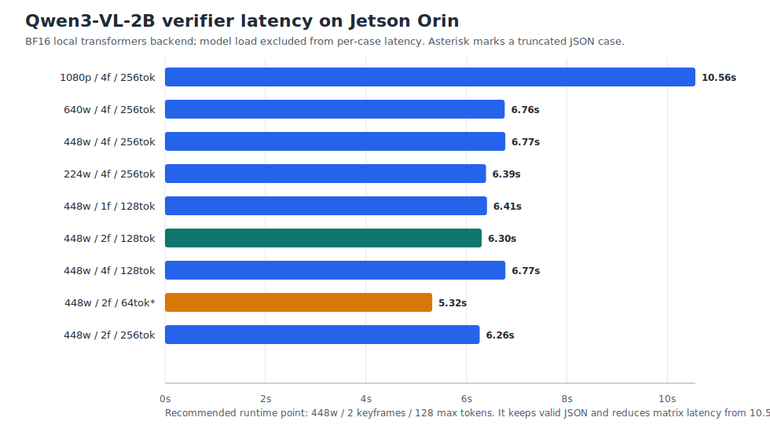

# Jetson Orin Qwen3-VL-2B VLM Verifier Smoke Report

Status date: 2026-05-12.
Status: exploratory runtime validation.

This note records the first local Qwen VLM verifier experiment on the Orin host. It validates that VRS can run YOLOE on the RTSP stream, promote a falldown candidate with a short smoke policy, and verify the candidate with `Qwen/Qwen3-VL-2B-Instruct` through the local `transformers` backend.



## Summary

| Field | Value |
|-------|-------|
| Host | `jetson-orin` |
| GPU model | Orin (`nvgpu`) |
| Memory | 64GB shared Jetson memory; PyTorch reports 61.37 GiB total |
| Driver / CUDA | NVIDIA-SMI 540.4.0, CUDA 12.6 |
| Jetson Linux | L4T R36.4.3, kernel 5.15.148-tegra |
| Python | 3.10.12 in `.venv-jetson` |
| torch | 2.7.0, CUDA 12.6 |
| transformers | 5.8.0 |
| ultralytics | 8.3.153 |
| Detector | YOLOE-S segmentation, `yoloe-11s-seg.pt`, FP16 |
| Verifier | `Qwen/Qwen3-VL-2B-Instruct`, BF16, local `transformers` backend |
| Config | `configs/jetson-qwen3vl2b.yaml` |
| Smoke policy | `configs/policies/falldown_orin_smoke.yaml` |
| RTSP source | `rtsp://<your-host>:8554/falldown` |
| VRS commit at test time | `88a1d33` plus local runtime edits |

## Environment Setup

The Jetson runtime uses Python 3.10 with `--system-site-packages` so the environment reuses the JetPack-compatible CUDA PyTorch wheel already installed on the host. A Python 3.11 `uv sync` environment was also created earlier, but that environment resolved to CPU-only PyTorch and is not suitable for Orin GPU inference.

Relevant setup files added for this profile:

- `requirements-jetson.txt`
- `scripts/setup_jetson_venv.sh`
- `configs/jetson-qwen3vl2b.yaml`
- `configs/policies/falldown_orin_smoke.yaml`

## Commands

```bash
cd ~/Documents/yp/vrs
scripts/setup_jetson_venv.sh
source .venv-jetson/bin/activate

python -m pytest tests/test_smoke.py -q
```

The final smoke checks passed:

```text
20 passed in 2.38s
```

## Code Changes Needed For Qwen3-VL

Two small runtime changes were needed:

1. `vrs/runtime/cosmos_loader.py` now passes explicit `VideoMetadata` when the caller gives a pre-sampled list of frames. This removes the Qwen3-VL warning that otherwise defaults timestamp construction to 24 fps.
2. The loader now supports `VLMConfig.max_frame_width`, exposed through `verifier.max_frame_width` in YAML. This downscales verifier frames before PIL conversion and processor tokenization.

The loader also now passes `dtype=` instead of deprecated `torch_dtype=`, and only passes `temperature` to generation when sampling is enabled.

## Baseline Runtime Result

Initial bounded RTSP run with the production-like safety policy:

| Metric | Value |
|--------|-------|
| Frames processed | 30 |
| Detector hits | 5 detections on 4 frames |
| Candidates | 0 |
| Detector latency | min 99.3 ms, median 132.4 ms, mean 162.5 ms, max 1176.4 ms |
| Verifier path | Forced candidate, because `safety.yaml` requires `falldown.min_persist_frames: 3` |
| Qwen load time | 11.41s |
| Qwen verify time | 14.03s |
| Final memory used | 12.22 GiB |

The detector produced falldown-like hits, but not enough persistent hits to promote a candidate under the default safety policy.

## Candidate Smoke Result

A short smoke policy lowered falldown persistence to two frames so the real `detector -> candidate -> verifier` path could be exercised.

| Metric | Before optimization | After optimization |
|--------|---------------------|--------------------|
| Policy | `falldown_orin_smoke.yaml` | `falldown_orin_smoke.yaml` |
| Keyframes | 4 | 2 |
| Max frame width | original 1080p input to verifier | 448 px before VLM processing |
| Max new tokens | 256 | 128 |
| Frames until candidate | 11 | 29 |
| Qwen load time | 11.44s | 14.48s |
| Qwen verify time | 12.01s | 8.07s |
| Final memory used | 12.15 GiB | 12.12 GiB |
| Verdict | `false` | `false` |

Optimized verifier rationale:

```text
The person is walking across the frame and does not appear to be lying motionless on the floor. There is no indication of a fall or collapse in the frames.
```

The optimized config reduced the real smoke-path verifier call from 12.01s to 8.07s. The measured load time is still high because each smoke script starts a fresh Python process and reloads model weights.

## Latency Matrix

Model load is excluded from the per-case latency values below. The model load for the matrix run was 13.37s. All cases used the same short RTSP sample and BF16 Qwen3-VL-2B model instance.

| Variant | Input shape | Max tokens | Verify latency | Verdict | Note |
|---------|-------------|------------|----------------|---------|------|
| 1080p / 4f / 256tok | 1080x1920 | 256 | 10.56s | false | valid JSON |
| 640w / 4f / 256tok | 360x640 | 256 | 6.76s | false | valid JSON |
| 448w / 4f / 256tok | 252x448 | 256 | 6.77s | false | valid JSON |
| 224w / 4f / 256tok | 126x224 | 256 | 6.39s | false | valid JSON |
| 448w / 1f / 128tok | 252x448 | 128 | 6.41s | false | valid JSON |
| 448w / 2f / 128tok | 252x448 | 128 | 6.30s | false | valid JSON |
| 448w / 4f / 128tok | 252x448 | 128 | 6.77s | false | valid JSON |
| 448w / 2f / 64tok* | 252x448 | 64 | 5.32s | true | truncated JSON / pass-through risk |
| 448w / 2f / 256tok | 252x448 | 256 | 6.26s | false | valid JSON |

The fastest `64` token run returned too little output for robust JSON parsing. It should not be used as the default. The best stable point from this run is `448 px`, `2 keyframes`, and `128 max_new_tokens`.

## Quantization Attempt

`bitsandbytes 0.49.2` installs and imports on the Jetson aarch64 environment, but Qwen3-VL-2B 4-bit loading failed during weight loading:

```text
bitsandbytes 0.49.2 installed and imports on Jetson aarch64, but Qwen/Qwen3-VL-2B-Instruct 4-bit BitsAndBytesConfig load failed during weight loading:

Error named symbol not found at line 62 in file /src/csrc/ops.cu

Conclusion: do not use bitsandbytes 4-bit as the default Jetson Orin runtime path for this experiment. Keep BF16 Qwen3-VL-2B and optimize frame width, keyframes, and max_new_tokens first.
```

This confirms that quantization needs a different Jetson-compatible path before it can be part of the default Orin runtime profile.

## Interpretation

The Orin 64GB host has enough memory headroom for Qwen3-VL-2B BF16 plus YOLOE-S. The final optimized smoke run used about 12.12 GiB out of 61.37 GiB as reported by PyTorch. Capacity is not the immediate blocker for this single-stream experiment.

Latency is the binding constraint. A local BF16 verifier call is still around 8.07s after downscaling and token-budget reduction. This is usable only as a slow-path verifier behind detector persistence and cooldown, not as a per-frame VLM path.

## Recommended Runtime Profile

Use this profile for the next Orin smoke runs:

```yaml
verifier:
  backend: transformers
  model_id: Qwen/Qwen3-VL-2B-Instruct
  dtype: bf16
  device: cuda
  context_window_s: 2.0
  keyframes: 2
  clip_fps: 2
  max_frame_width: 448
  max_new_tokens: 128
  temperature: 0.0
  request_bbox: true
  request_trajectory: false
```

Keep `configs/policies/falldown_orin_smoke.yaml` for bounded plumbing tests, but use the production `configs/policies/safety.yaml` for real evaluation once a longer labeled falldown stream is available.

## Raw Artifacts

| Artifact | Purpose |
|----------|---------|
| `runs/orin_qwen3vl2b_experiment/summary.json` | Initial detector and forced-verifier smoke summary |
| `runs/orin_qwen3vl2b_candidate_smoke/summary.json` | Real candidate smoke before frame/token optimization |
| `runs/orin_qwen3vl2b_latency_matrix/summary.json` | Resolution/keyframe/token latency matrix |
| `runs/orin_qwen3vl2b_latency_matrix/quantization_bnb_result.txt` | bitsandbytes 4-bit failure note |
| `runs/orin_qwen3vl2b_optimized_smoke/summary.json` | Optimized detector-candidate-verifier smoke summary |

## Future Plan

This report should remain scoped to VRS pipeline validation. It is not a general Jetson LLM inference benchmark, and it should not be used to compare 2B, 3B, and 7B model capacity by itself.

### VRS Testing Plan

1. Run a longer RTSP stability window with the optimized profile. Record stream uptime, detector latency p50/p95, candidate rate, verifier call count, verifier p50/p95 latency, queue backlog, dropped frames, and memory over time.
2. Build a small falldown clip set with positive and negative examples. Measure detector-only recall, full cascade precision/recall, and verifier false-positive suppression.
3. Sweep `falldown.min_score` and `falldown.min_persist_frames` against the labeled clips. Keep `falldown_orin_smoke.yaml` only for plumbing tests; promote a separate policy once the sweep has evidence.
4. Run replicated RTSP or recorded-stream tests at 1, 2, 4, and 8 streams. The main question is whether verifier latency creates backlog under realistic candidate rates.
5. Check operator-facing outputs: event JSON, timestamps, thumbnails or frame references, verifier rationale, and bounding-box context. The smoke test proves execution; this step checks whether the generated alert is useful.

### Separate Inference Experiments

Keep model-size and inference-system experiments in a separate benchmark note aligned with `efficient-llm-inference-systems/week03`. That track should cover Qwen 3B/7B tests, KV-cache behavior, batch or sequence sweeps, TensorRT/vLLM/TRT-LLM serving paths, and quantization backends. Those results can inform VRS model selection later, but they should not be mixed with the first VRS pipeline validation plan.

## Immediate Next Steps

- Run a longer RTSP window and record candidate rate, false-positive rate, and verifier p50/p95 latency with the optimized profile.
- Add a small labeled falldown clip set so Qwen verifier accuracy is measurable, not inferred from one stream.
- Keep served/runtime-optimized backend work in the separate inference benchmark track until the VRS pipeline metrics above are repeatable.
